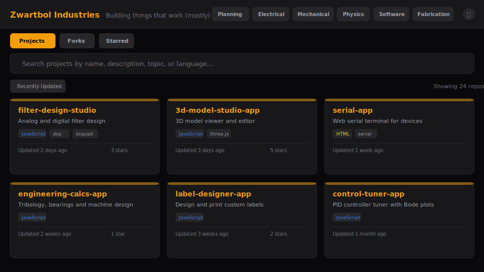
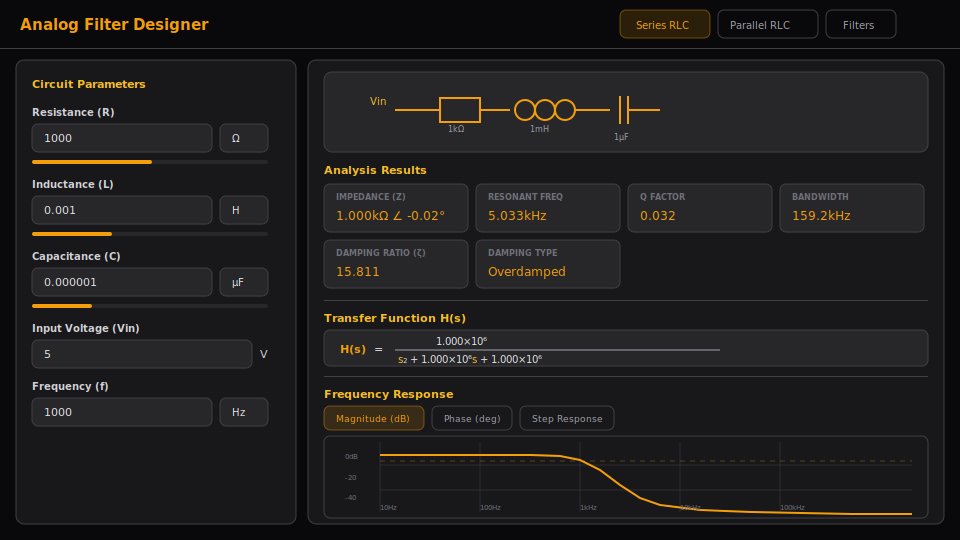
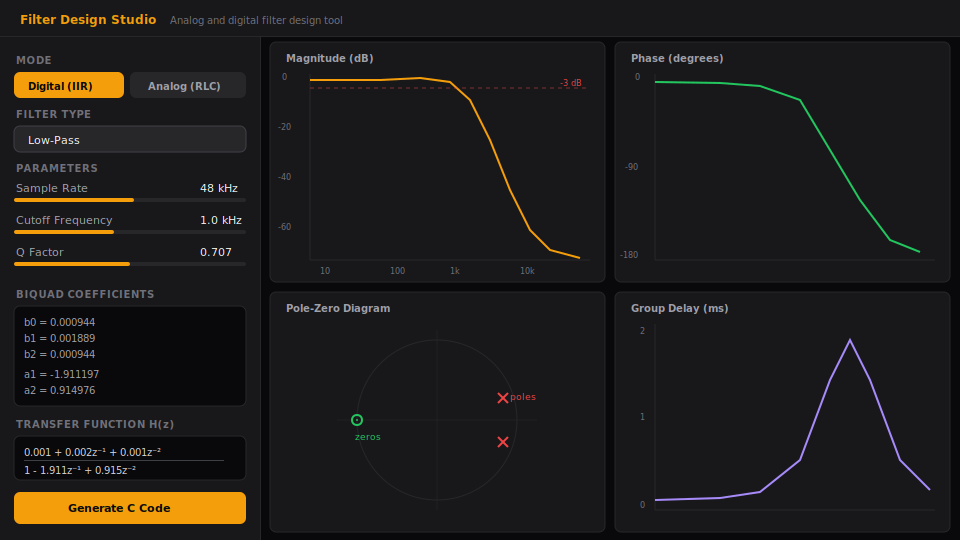

# Maker Portfolio

A GitHub-powered portfolio site for showcasing maker and tinkerer projects, with ten integrated tools for electronics, design, and 3D modeling.

Built as a single-page application using React 18, Tailwind CSS, and a dark zinc/amber terminal-inspired theme.

## Features

### Project Explorer

The main view fetches your GitHub repositories and displays them as terminal-style cards with:

- **Search & filter** by name, description, topic, or language
- **Sort** by recently updated, most stars, or alphabetically
- **Project modal** with README rendering, syntax-highlighted code viewer, and file tree navigation
- **Forked projects** tab to browse forks separately
- **Admin mode** with password-protected repo hide/unhide



### Lab Inventory

An electronics component inventory manager (admin-only tab). Tracks items, storage boxes, and shelf locations with:

- QR code scanning and generation
- Photo uploads per component
- Category/theme filtering
- JSON/ZIP import and export
- Batch label printing

### Label Designer

A canvas-based label design tool for creating and printing custom labels.


- **Text elements** with configurable font, size, bold/italic, color, and letter spacing
- **Barcode support** for CODE128, UPC-A, EAN-13, and QR codes
- **Shapes** — rectangle (with rounded corners), ellipse, and line
- **Inventory integration** — import component name + 12NC barcode from Lab Inventory
- **Layers panel** with drag-to-reorder
- **Properties panel** for precise positioning and styling
- **Element resizing** with corner drag handles
- **Grid & snap** — toggleable 1mm/5mm grid with 0.5mm snap
- **Zoom** from 1x to 8x
- **Export to PNG** at configurable DPI (72–1200)
- **Print** directly to printer
- **Keyboard shortcuts** — Select (V), Text (T), Duplicate (Ctrl+D), Delete, Nudge (arrows)

### Resistor Color Code Generator

A 4-band resistor color code tool with camera-based scanning.


- **Value → Colors** — enter a resistance in ohms to generate color bands
- **Colors → Value** — select four bands to calculate the resistance
- **Camera scanner** — use your phone camera to scan physical resistors
  - CIE LAB color space matching for accurate band detection
  - Auto-populates dropdowns and calculates the value
- Visual color swatches for each detected band

### Datasheet Search

A multi-source component datasheet finder.


- **Six sources** — AllDatasheet, Datasheet Archive, Octopart, DigiKey, Mouser, LCSC
- **Quick-search categories** — Voltage Regulators, Op-Amps, MCUs, Sensors, and more
- **Popular components** — one-click search for common parts (NE555, LM7805, ATmega328P, etc.)
- **Search history** — last 50 searches with timestamps
- **Bookmarks** — star frequently-used searches
- Browse, History, and Bookmarks tabs

### 3D Model Library

Upload and view STL, 3MF, AMF, OBJ, and G-code files in the browser.


- **Three.js viewer** with orbit controls (rotate, pan, zoom)
- **IndexedDB storage** — models persist locally across sessions
- **Auto-generated thumbnails** for the library grid
- **Drag & drop** or click to upload (multi-file supported)
- **Model info** — dimensions (mm), triangle count, file size
- **Rename & delete** from library or viewer
- Auto-scaled grid floor and camera fitting

### Analog Filter Designer

Continuous-time analog filter design and RLC circuit analysis.



- **Three modes** — Series RLC, Parallel RLC, and Filters (LP/HP/BP/BS in RC, RL, RLC variants)
- **Circuit parameters** — Resistance, Inductance, Capacitance with unit selectors and sliders
- **Input voltage** and **frequency** controls
- **Transfer function H(s)** — Laplace-domain display with symbolic numerator/denominator polynomials
- **Analysis results** — Impedance (magnitude + phase), resonant frequency, Q factor, bandwidth, damping ratio, damping type, component voltages/currents
- **Four plots** — Magnitude (dB), Phase (degrees), Step Response, Impulse Response
- **Circuit diagram** — SVG schematic updates per mode
- Engineering notation throughout (e.g. 5.033kHz, 1.000kΩ)

### Digital Filter Designer

An interactive biquad IIR filter designer with real-time frequency response.



- **Eight filter types** — Low-Pass, High-Pass, Band-Pass, Notch, Peaking EQ, Low Shelf, High Shelf, All-Pass
- **Parameters** — Sample rate (1–384kHz), cutoff/center frequency (log-mapped slider), Q factor (log-mapped), gain (dB, for peaking/shelf types)
- **Coefficient display** — Normalized Direct Form I biquad coefficients (b0, b1, b2, a1, a2)
- **Transfer function H(z)** — Z-domain display with coefficients in z⁻¹/z⁻² form
- **Four plot views** — Magnitude (dB), Phase, Group Delay (ms), Impulse Response (stem plot)
- **Pole-zero diagram** — Unit circle with zero markers (circles) and pole markers (crosses)
- **C code generation** — Ready-to-use `Biquad` struct with `biquad_init`/`biquad_process` functions
- **Copy button** — One-click copy of generated implementation code
- Uses Robert Bristow-Johnson's Audio EQ Cookbook formulas

### External Tools

Two third-party simulators are embedded as fullscreen tabs:

- **Ray Optics** — interactive ray optics simulator ([phydemo.app](https://phydemo.app/ray-optics/simulator/))
- **Circuit Sim** — interactive circuit simulator ([falstad.com](https://www.falstad.com/circuit/circuitjs.html))

## Tech Stack

| Component | Stack |
|-----------|-------|
| Portfolio | React 18 (UMD), Tailwind CSS, Babel, Lucide Icons, marked.js, highlight.js |
| Lab Inventory | Vanilla JS, Tailwind CSS, Material Icons |
| Label Designer | Vanilla JS, JsBarcode, QR code generator |
| Resistor Colors | Vanilla JS (CIE LAB color space) |
| Datasheet Search | Vanilla JS, localStorage |
| 3D Model Library | Three.js (r160), IndexedDB |
| Analog Filter Designer | Vanilla JS, Canvas API, SVG circuit diagrams |
| Digital Filter Designer | Vanilla JS, Canvas API (Audio EQ Cookbook biquad formulas) |

All local apps are self-contained single HTML files with inline CSS/JS. Lab Inventory and Label Designer include PWA manifests and service workers for offline support.

## Getting Started

Clone the repo and open `index.html` in a browser, or serve with any static file server:

```sh
python3 -m http.server 8080
```

Configure your GitHub username and preferences in the `CONFIG` object at the top of `index.html`.

## Release Notes

The portfolio footer includes an expandable **Release Notes** panel that shows version history per git commit hash, grouped by date. Each entry links to the corresponding GitHub commit.

A full changelog is maintained in [`RELEASES.md`](RELEASES.md).

The `VERSION_HISTORY` array in `index.html` drives the in-app display, while the pre-commit hook (`.githooks/pre-commit`) auto-updates `BUILD_COMMIT` and `BUILD_DATE` on each commit.

## Project Structure

```
pages/
├── index.html                     # Main portfolio page (React SPA)
├── README.md
├── RELEASES.md                    # Full release history
├── screenshots/                   # Documentation screenshots
├── lab-inventory-app/
│   ├── index.html                 # Inventory manager
│   ├── manifest.json              # PWA manifest
│   └── sw.js                      # Service worker
├── label-designer/
│   ├── index.html                 # Label design tool
│   ├── manifest.json              # PWA manifest
│   └── sw.js                      # Service worker
├── resistor-colorcode-gen/
│   ├── index.html                 # Resistor color code tool
│   ├── script.js                  # App logic + camera scanner
│   └── styles.css                 # Styling
├── datasheet-search/
│   └── index.html                 # Datasheet search tool
├── model-library/
│   └── index.html                 # 3D model viewer/library
├── engcalc-pwa/
│   ├── index.html                 # Engineering calculators
│   ├── manifest.json              # PWA manifest
│   └── sw.js                      # Service worker
├── rlc-calculator/
│   └── rlc-calculator.html        # Analog filter designer
├── biquad-pwa/
│   └── index.html                 # Digital filter designer
└── .githooks/
    └── pre-commit                 # Auto-updates BUILD_COMMIT and BUILD_DATE
```
