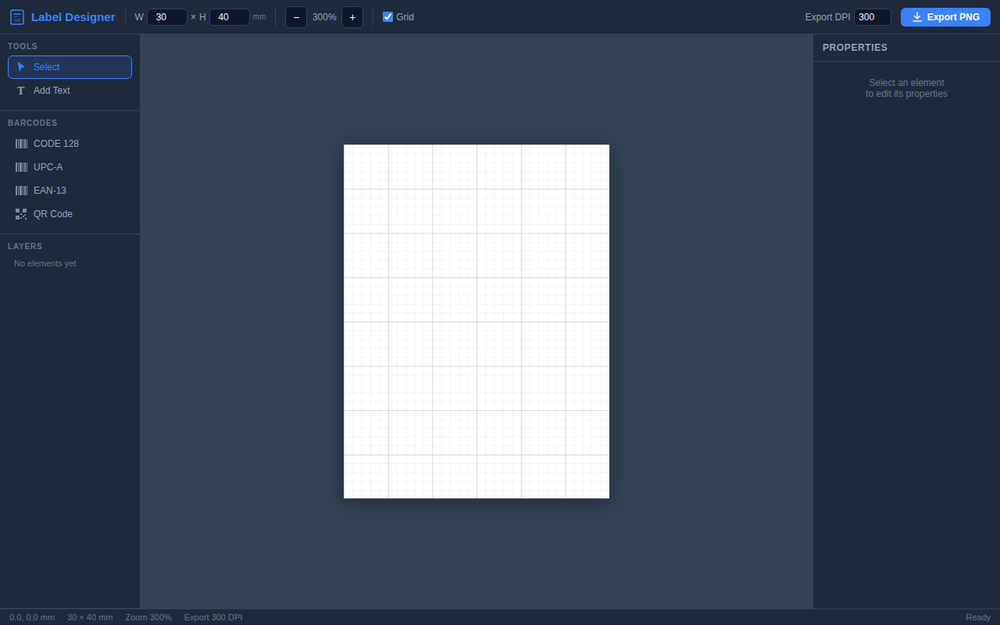

# Maker Portfolio

A GitHub-powered portfolio site for showcasing maker and tinkerer projects, with integrated local web apps for lab inventory management and label design.

Built as a single-page application using React 18, Tailwind CSS, and a dark terminal-inspired theme.

## Features

### Project Explorer

The main view fetches your GitHub repositories and displays them as terminal-style cards with:

- **Search & filter** by name, description, topic, or language
- **Sort** by recently updated, most stars, or alphabetically
- **Project modal** with README rendering, syntax-highlighted code viewer, and file tree navigation
- **Forked projects** tab to browse forks separately
- **Admin mode** with password-protected repo hide/unhide

### Lab Inventory

An electronics component inventory manager embedded as a tab. Tracks items, storage boxes, and shelf locations with:

- QR code scanning and generation
- Photo uploads per component
- Category/theme filtering
- JSON/ZIP import and export
- Batch label printing

### Label Designer

A canvas-based label design tool for creating and printing custom labels with barcode support.



- **Text elements** with configurable font, size, bold/italic, color, and letter spacing
- **Barcode support** for CODE128, UPC-A, EAN-13, and QR codes
- **Layers panel** with drag-to-reorder
- **Properties panel** for precise positioning
- **Export to PNG** at configurable DPI (72-1200)
- **Keyboard shortcuts** for select (V), text (T), duplicate (D), nudge (arrows), and delete

## Tech Stack

| Component | Stack |
|-----------|-------|
| Portfolio | React 18, Tailwind CSS, Babel, Lucide Icons, marked.js, highlight.js |
| Lab Inventory | Vanilla JS, Tailwind CSS, Material Icons |
| Label Designer | Vanilla JS, Custom CSS, JsBarcode, QR code generator |

All three apps are self-contained single HTML files and work as Progressive Web Apps (PWA) with offline support via service workers.

## Getting Started

Clone the repo and open `index.html` in a browser, or serve with any static file server:

```sh
python3 -m http.server 8080
```

Configure your GitHub username and preferences in the `CONFIG` object at the top of `index.html`.

## Project Structure

```
pages/
├── index.html              # Main portfolio page
├── lab-inventory-app/
│   ├── index.html          # Inventory manager
│   ├── manifest.json       # PWA manifest
│   └── sw.js               # Service worker
└── label-designer/
    ├── index.html          # Label design tool
    ├── manifest.json       # PWA manifest
    └── sw.js               # Service worker
```
